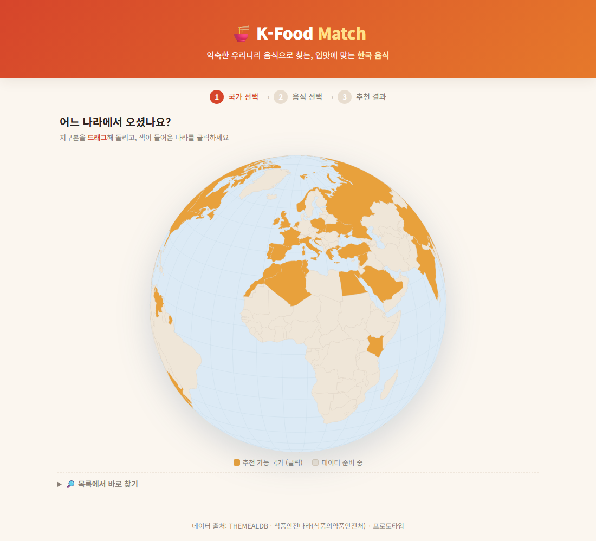
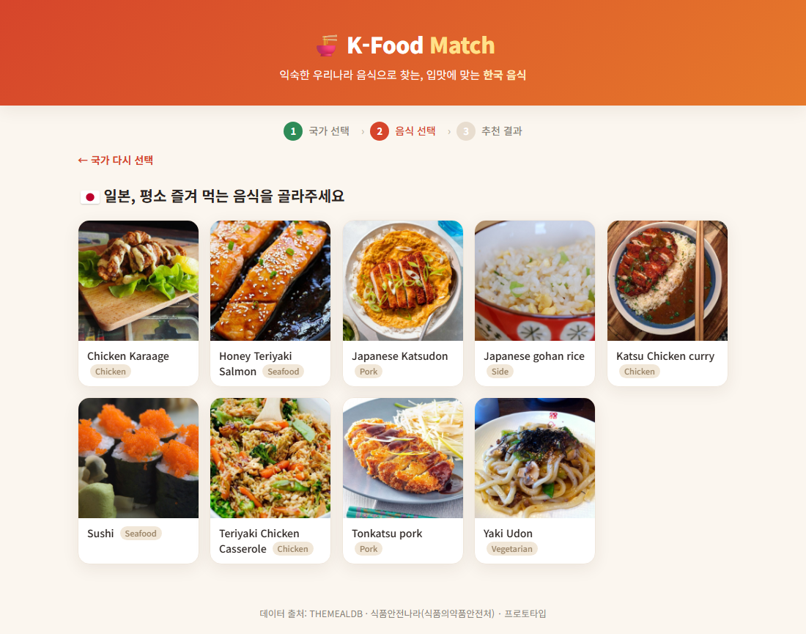
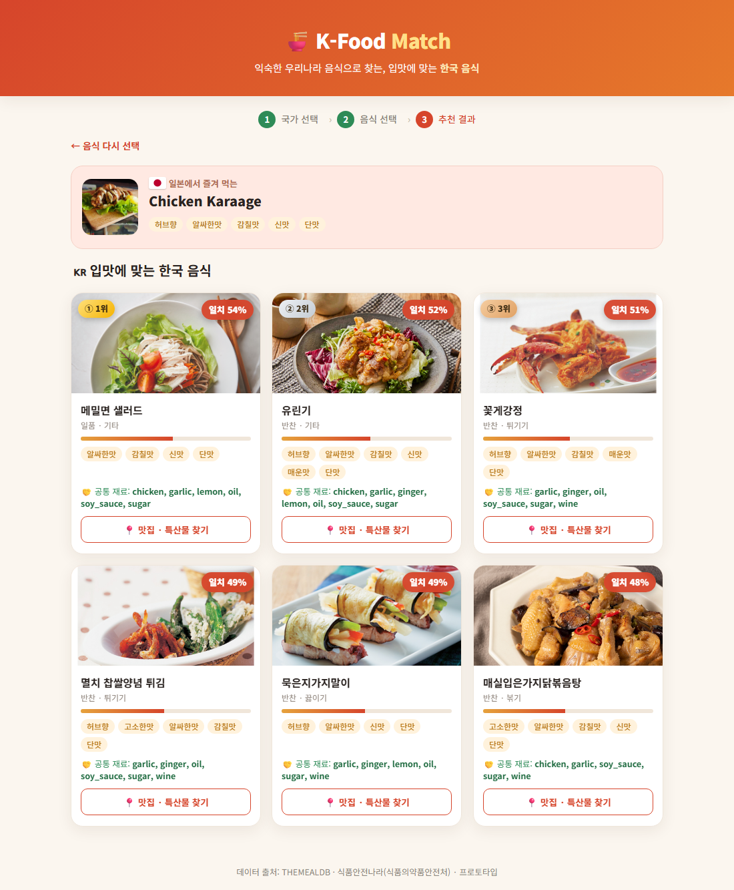
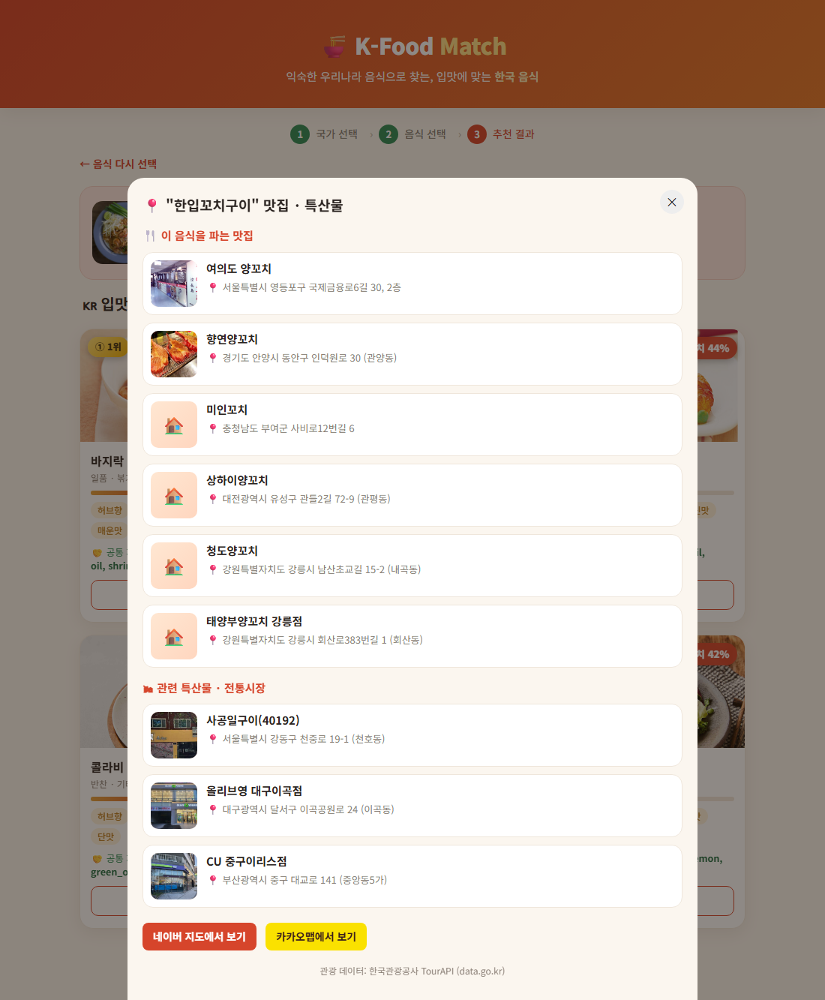

# 「제4회 문화체육관광 인공지능·데이터 활용 공모전」기획서

**— 문화데이터 활용 분야 / 제품·서비스 부문 —**

| 구분 | 내용 |
|---|---|
| **사례명** | 외국인 관광객을 위한 **유사 한식 추천 & 관광 연계** 데이터 매핑 서비스 — **K-Food Match** |
| **제품·서비스 유형** | ☑ 웹(Web)  ※ 실행 방법은 본문 부록 참조 |
| **한 줄 소개** | 익숙한 자국 음식을 고르면 **재료·맛이 비슷한 한국 음식**을 추천하고, 그 음식을 즐길 **맛집·특산물 판매처**까지 안내하는 식문화·관광 융합 서비스 |

---

## 1) 제품·서비스 소개 및 목적(요약)

최근 한국을 방문하는 외국인 관광객이 증가하면서 음식은 관광 만족도를 결정하는 핵심 요소로 자리잡고 있다. 관광객들은 명소 방문뿐 아니라 **현지 음식 체험**을 여행의 주요 목적으로 인식하며, 음식 경험은 한국 문화에 대한 이해와 재방문 의사에도 큰 영향을 미친다.

그러나 한식은 **음식명만으로 재료와 맛을 직관적으로 파악하기 어렵다.** '김치찌개', '육개장', '순두부찌개'는 한국인에게 익숙하지만, 외국인은 그 음식이 맵거나 특정 향신료를 쓰는지, 자신이 즐겨 먹는 음식과 비슷한지 판단하기 어렵다. 이런 정보 부족은 음식 선택을 부담스럽게 만들고, 결국 **소수의 유명 음식·관광지에 소비가 집중**되는 결과로 이어진다.

본 서비스 **K-Food Match**는 이 문제를 두 축으로 해결한다.

1. **식문화 기반 개인화 추천** — 관광객이 익숙한 **자국 음식**을 기준으로, 재료·맛이 유사한 한국 음식을 추천하여 심리적 진입장벽을 낮춘다.
2. **관광·지역상권 연계** — 추천된 한식을 실제로 즐길 수 있는 **맛집과 관련 특산물·전통시장**을 공공데이터로 안내하여, 음식 경험을 지역 관광 동선으로 확장한다.

이를 위해 공공데이터(한식 레시피·해외 음식·관광정보)를 수집·가공하여 음식 간 관계를 구조화한 **'음식 데이터 허브'**를 구축하였으며, 본 기획서 제출 시점에 **실제 동작하는 웹 프로토타입**으로 구현을 완료하였다.

---

## 2) 제품·서비스 상세 설명 (화면 중심)

사용자 흐름은 **① 세계지도(홈) → ② 국가별 대표 음식 선택 → ③ 유사 한식 추천 → ④ 맛집·특산물 안내** 4단계로 구성된다.

### 화면 ① — 홈: 드래그 가능한 세계 지구본



접속 시 **드래그로 자유롭게 회전하는 3D 세계 지구본**이 나타난다. 서비스가 데이터를 보유한 **37개국이 주황색으로 강조**되며(범례 제공), 해당 국가에 마우스를 올리면 나라 이름과 보유 음식 수가 표시되고, **클릭하면 음식 선택 단계로 진입**한다. 지도에 익숙하지 않은 사용자를 위해 하단에 '목록에서 바로 찾기' 보조 검색도 제공한다. 외국인 관광객이 **'내 나라'를 직관적으로 찾는** 경험을 첫 화면에 배치하여 친근감을 높였다.

### 화면 ② — 국가별 대표 음식 선택



선택한 국가의 대표 음식이 **실제 음식 사진 카드**로 제시된다(예: 일본 → 가라아게·연어 데리야키·가츠동·스시…). 사용자는 평소 즐겨 먹는 음식을 직접 고른다. 각 카드에는 음식 분류(카테고리)가 함께 표기되어 선택을 돕는다.

### 화면 ③ — 유사 한식 추천 결과



선택한 음식과 **재료·맛이 가장 비슷한 한국 음식**을 일치율 순으로 추천한다. 각 추천 카드는 다음 정보를 제공한다.

- **일치율(%)** 과 **1~3위 메달 배지** — 어떤 음식이 가장 가까운지 한눈에
- **맛 프로파일 태그** — 매운맛·감칠맛·고소한맛·단맛 등 (한식의 '맛의 방향'을 시각화)
- **공통 재료** — "이 음식과 한식이 어떤 재료를 공유하는지" 추천 근거를 투명하게 제시
- 상단에는 사용자가 고른 음식을 *"○○에서 즐겨 먹는 △△"* 형태로 보여 맥락을 유지

이로써 사용자는 *"내가 좋아하는 음식과 왜 이 한식이 비슷한지"*를 납득하며 새로운 한식을 안심하고 시도할 수 있다.

### 화면 ④ — 맛집·특산물 안내 (관광 연계)



각 추천 한식 카드의 **'📍 맛집·특산물 찾기'** 버튼을 누르면, 그 음식을 즐길 수 있는 정보가 표시된다.

- 🍴 **맛집(음식점)** — 한국관광공사 관광정보의 실제 음식점을 사진·주소와 함께 제공
- 🛍 **관련 특산물·전통시장** — 지역 특산물·시장 등 쇼핑 정보 제공
- **네이버·카카오맵 바로가기** — 위치 확인 및 길찾기로 즉시 연결

추천(무엇을 먹을지)에서 그치지 않고 **"어디서 먹고, 무엇을 살지"**까지 연결하여, 음식 경험을 **지역 방문·소비**로 이어지게 한 것이 핵심이다.

### 내부 동작 요약

음식명 → **재료 추출** → **한↔영 표준 재료 사전**으로 정규화 → **맛 프로파일** 산출 → **가중 유사도** 계산 → 가장 가까운 한식 추천. (자세한 데이터 처리는 5·6번 참조)

---

## 3) 제품·서비스 차별성

| 구분 | 기존 음식 추천 서비스 | **K-Food Match** |
|---|---|---|
| 추천 근거 | 리뷰·평점·인기순위 | **재료·맛 속성 기반** (외국인에게 실질적) |
| 언어 장벽 | 고려 안 함 | **한↔영 표준 재료 사전**으로 해외-한식 직접 연결 |
| 데이터 구조 | 단순 목록 | 음식 간 관계를 연결한 **음식 데이터 허브** |
| 관광 연계 | 없음 | **맛집·특산물(공공데이터)** 까지 원스톱 |
| 목적 | 현지인 편의 | **외국인 식문화 진입장벽 해소 + 지역관광 활성화** |

가장 큰 차별점은 ① **언어가 다른 해외 음식과 한식을 하나의 표준 재료 체계로 연결**한 점(예: 영어 `Soy Sauce`와 한글 `간장`을 같은 토큰으로 매칭), 그리고 ② **식문화 추천과 관광 정보를 결합**해 단순 추천 시스템을 넘어 **'식문화-관광 데이터 플랫폼'**으로 설계한 점이다.

---

## 4) 제품·서비스 성과 및 기대효과

### ① 관광 활성화

- **음식 선택 진입장벽 완화 → 관광 만족도 향상**: 자국 음식 기반 추천으로 낯선 한식을 안심하고 시도.
- **소비 분산 효과**: 추천 한식의 맛집·특산물을 전국 단위로 안내하여, 특정 유명 관광지에 집중된 소비를 **다양한 지역으로 분산**. 지역 상권·전통시장 활성화에 기여.
- **관광 동선 설계 지원**: 음식 추천 + 위치 정보 + 지도 연계로 **'먹거리 중심 여행 일정'**을 손쉽게 구성.

### ② 식문화 진흥 (한식 세계화)

- **한식의 '맛'을 데이터로 번역**: 맵다/감칠맛/고소함 등 비정형 정보를 정형 데이터로 만들어, 외국인이 한식을 **자국 식문화의 언어로 이해**하도록 지원.
- **국가 간 식문화 비교 기반**: 재료·맛으로 연결된 데이터 허브는 *"어느 나라 음식과 어떤 한식이 닮았는가"*라는 **식문화 교류·연구의 기초 데이터**가 된다.
- **확장 가능성**: 축적된 음식 관계 데이터는 한식 콘텐츠 제작, 식품 산업(제품 기획), 관광 마케팅 등으로 확장 가능. 데이터가 늘수록 추천 정확도와 적용 국가가 함께 확대된다.

---

## 5) 문화데이터 활용

본 서비스는 **3종의 공공·공개 데이터**를 수집·가공하여 활용한다.

| 활용 데이터 | 제공기관 | 출처/플랫폼 | 규모(구축) |
|---|---|---|---|
| 조리식품의 레시피 DB (COOKRCP01) | 식품의약품안전처 | 식품안전나라 / 공공데이터포털 | 한식 **1,051종** |
| THEMEALDB | THEMEALDB (해외 공개 API) | themealdb.com | 해외 **671종 (37개국)** |
| 국문 관광정보 서비스(GW) | **한국관광공사** | 공공데이터포털(data.go.kr) TourAPI | 음식점·쇼핑 실시간 조회 |

**데이터 처리·가공 내용**

1. **수집** — 식품안전나라 OpenAPI로 한식 레시피 전체(1,146건 중 유효 1,051건)를 페이징 수집, THEMEALDB는 알파벳 전수 검색으로 전 국가 음식을 수집.
2. **재료 정제** — 레시피 원문(`RCP_PARTS_DTLS`)에서 용량·구획어를 제거해 재료명만 추출(예: `양파(50g)`→`양파`).
3. **한↔영 표준화** — 약 55종의 핵심 재료를 **표준 토큰**으로 통일(`간장`=`Soy Sauce`=`soy_sauce`). 언어가 다른 두 데이터를 연결하는 핵심 단계.
4. **맛 프로파일화** — 재료로부터 매운맛·감칠맛·고소함·단맛 등 **맛 속성**을 산출.
5. **관광 연계** — 추천 한식명에서 대표 요리 종류 키워드(갈비·국밥·꼬치 등)를 추출해 **TourAPI 음식점·쇼핑 정보**를 실시간 조회.

문화데이터는 본 서비스에서 **추천의 근거(재료·맛)** 이자 **관광 연계의 실데이터(맛집·특산물)** 라는 핵심 역할을 수행한다.

---

## 6) AI·데이터 기술 활용

- **비정형 → 정형 변환**: 음식의 맛·향·식감과 같은 **비정형 특성**을 정형 속성으로 변환하여 음식 간 비교를 가능하게 한다.
- **유사도 기반 추천 엔진**: 표준 재료 토큰에 대한 **가중 자카드 유사도**(양념·맛 핵심 재료에 가중치)와 **맛 프로파일 유사도**를 결합해 추천 점수를 산출한다.
- **데이터 허브 자동 확장**: 새로운 음식이 추가되면 동일한 추출·표준화 과정을 반복해 허브가 자동 확장되도록 설계.
- **고도화 로드맵**: 현재 규칙 기반의 맛 속성 추출 단계를 향후 **생성형 AI(예: OpenAI) 속성 추출**로 교체하여, 더 세밀한 향·식감·조리특성까지 정형화할 계획이다.

---

## 부록 A. 실행 방법 (실행 가능 여부 확인용)

```bash
# 1. 데이터 수집(최초 1회)
pip install requests pandas
python src/collect_foreign.py      # 해외 음식(THEMEALDB)
python src/collect_korean.py       # 한식(식품안전나라)

# 2. 관광 연계용 키 설정 (선택)
#    config.example.json → config.json 복사 후 TourAPI 인증키 입력

# 3. 서버 실행
python app.py                      # → http://localhost:8000
```

## 부록 B. 데이터 출처 URL

- 식품안전나라 레시피DB: `https://www.foodsafetykorea.go.kr/api/openApiInfo.do?...&svc_no=COOKRCP01`
- THEMEALDB: `https://www.themealdb.com/api.php`
- 한국관광공사 국문 관광정보 서비스(GW): `https://www.data.go.kr/data/15101578/openapi.do`

## 부록 C. 기술 스택

- 데이터: 식품안전나라 · THEMEALDB · 한국관광공사 TourAPI (공공/공개 데이터)
- 백엔드: Python (표준 라이브러리 HTTP 서버 + REST API)
- 프론트엔드: HTML/CSS/JavaScript, D3.js(세계 지구본)
- 추천 엔진: 한↔영 표준 재료 사전 + 가중 유사도 + 맛 프로파일
